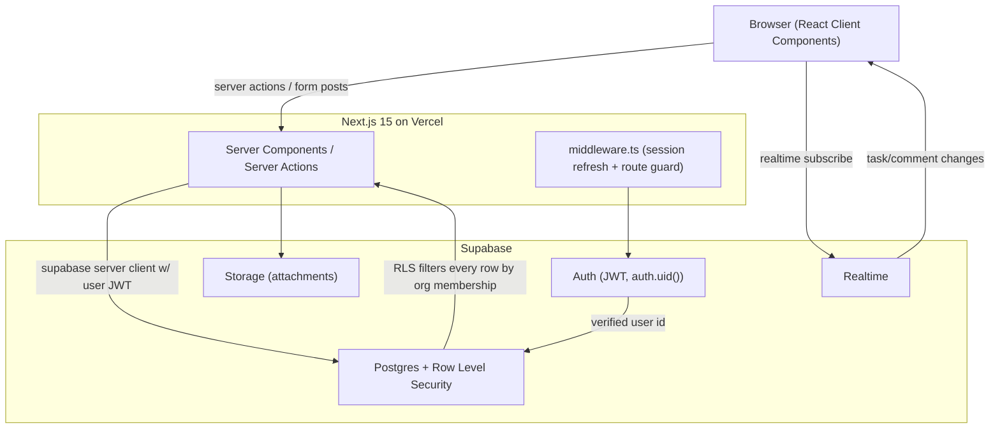
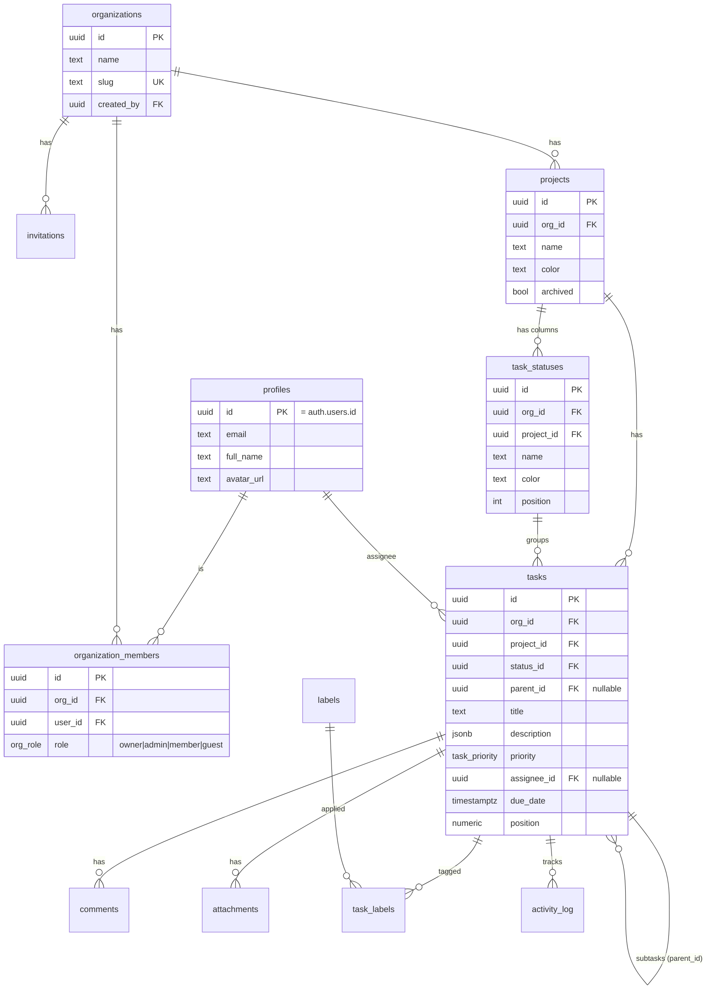

# TaskFlow — Multi-Tenant Task Management SaaS

**One-shot build spec for Claude Code.** Hand this whole file to Claude Code. It contains the stack, architecture, database schema, security model, feature list, build sequence, and the master prompt. Designed so the app is built end-to-end with no follow-up clarification needed.

A ClickUp / Jira / Notion–style task manager: organizations (tenants) are fully isolated from each other, each org has projects, each project has tasks shown in Board (Kanban) and List views, with members, roles, comments, labels, and real-time updates.

---

## 0. How to use this file

1. Create a Supabase project at https://supabase.com → copy the Project URL, anon key, and service-role key.
2. Open Claude Code in an empty folder.
3. Paste **Section 9 (THE MASTER PROMPT)** as your first message, then paste this entire file below it as context.
4. Claude Code builds the app. Run `npm run dev` and follow the printed setup steps.

---

## 1. Product scope (what "done" means)

**Simple but powerful.** Ship exactly these, nothing more:

- Email/password + Google sign-in (Supabase Auth).
- Create an organization on signup; switch between orgs you belong to (org switcher in the header).
- Invite teammates by email; assign roles (owner / admin / member / guest).
- Inside an org: create projects.
- Inside a project: create tasks with title, description (rich text), status, priority, assignee, due date, labels, and subtasks.
- Two task views per project: **Board** (Kanban, drag-and-drop between status columns) and **List** (sortable table).
- Task detail panel: edit fields, threaded comments, attachments, activity history.
- Real-time: changes by one member appear instantly for others in the same project.
- Hard tenant isolation: a user can never read or write another org's data. Enforced at the database with Row Level Security, not just in app code.

**Explicitly out of scope (v1):** billing/Stripe, custom fields, automations, time tracking, mobile app, multiple workspaces per org. Leave clean seams for these but don't build them.

---

## 2. Tech stack (decided — do not substitute)

| Layer | Choice | Why |
|---|---|---|
| Framework | Next.js 15 (App Router, TypeScript) | Server Components + Server Actions, one codebase |
| Styling | Tailwind CSS v4 + shadcn/ui | Fast, owned components |
| Auth | Supabase Auth | Same system that powers RLS via `auth.uid()` |
| Database | Supabase Postgres | Tenant isolation enforced by RLS |
| Data access | `@supabase/ssr` (server + browser clients) | RLS-aware queries, no separate ORM needed |
| Real-time | Supabase Realtime (Postgres changes) | Built in, no extra service |
| File storage | Supabase Storage | Attachments |
| Drag & drop | `@dnd-kit/core` + `@dnd-kit/sortable` | Kanban board |
| Rich text | Tiptap (`@tiptap/react`) | Task descriptions & comments |
| Forms | React Hook Form + Zod | Typed validation |
| Server state | TanStack Query (`@tanstack/react-query`) | Caching + optimistic updates |
| Icons | lucide-react | — |
| Deploy | Vercel (app) + Supabase (DB) | — |

> **Auth decision:** use **Supabase Auth**, not Clerk. Tenant isolation depends on `auth.uid()` being available inside Postgres RLS policies, which Supabase Auth gives natively. Mixing in Clerk would break that link.

---

## 3. Architecture



**Multi-tenancy pattern:** shared database, `org_id` column on every tenant table, plus RLS. This is option A (the standard SaaS choice). RLS is the safety net so a forgotten `where org_id =` filter can never leak data across tenants.

**Request flow:** Every read/write goes through a Supabase client created with the logged-in user's JWT. Postgres evaluates RLS policies using `auth.uid()`, so the database itself refuses rows the user's org membership doesn't allow.

---

## 4. Data model (ERD)



---

## 5. Full SQL schema + RLS (Supabase migration)

Save as `supabase/migrations/0001_init.sql`. This is the authoritative security layer. Run via `supabase db push` or paste into the Supabase SQL editor.

```sql
-- ============================================================
-- TaskFlow initial schema + multi-tenant RLS
-- ============================================================

-- Extensions
create extension if not exists "pgcrypto";

-- Enums
create type org_role as enum ('owner', 'admin', 'member', 'guest');
create type task_priority as enum ('none', 'low', 'medium', 'high', 'urgent');
create type invite_status as enum ('pending', 'accepted', 'revoked');

-- ------------------------------------------------------------
-- profiles : 1-1 mirror of auth.users (public-readable basics)
-- ------------------------------------------------------------
create table profiles (
  id          uuid primary key references auth.users(id) on delete cascade,
  email       text not null,
  full_name   text,
  avatar_url  text,
  created_at  timestamptz not null default now()
);

-- ------------------------------------------------------------
-- organizations (tenants)
-- ------------------------------------------------------------
create table organizations (
  id          uuid primary key default gen_random_uuid(),
  name        text not null,
  slug        text unique not null,
  logo_url    text,
  created_by  uuid not null references profiles(id),
  created_at  timestamptz not null default now()
);

create table organization_members (
  id          uuid primary key default gen_random_uuid(),
  org_id      uuid not null references organizations(id) on delete cascade,
  user_id     uuid not null references profiles(id) on delete cascade,
  role        org_role not null default 'member',
  created_at  timestamptz not null default now(),
  unique (org_id, user_id)
);
create index on organization_members(user_id);
create index on organization_members(org_id);

create table invitations (
  id          uuid primary key default gen_random_uuid(),
  org_id      uuid not null references organizations(id) on delete cascade,
  email       text not null,
  role        org_role not null default 'member',
  token       text not null unique default encode(gen_random_bytes(24),'hex'),
  status      invite_status not null default 'pending',
  invited_by  uuid not null references profiles(id),
  created_at  timestamptz not null default now(),
  unique (org_id, email)
);

-- ------------------------------------------------------------
-- projects
-- ------------------------------------------------------------
create table projects (
  id          uuid primary key default gen_random_uuid(),
  org_id      uuid not null references organizations(id) on delete cascade,
  name        text not null,
  description text,
  color       text default '#6366f1',
  archived    boolean not null default false,
  created_by  uuid not null references profiles(id),
  created_at  timestamptz not null default now()
);
create index on projects(org_id);

-- board columns, per project
create table task_statuses (
  id          uuid primary key default gen_random_uuid(),
  org_id      uuid not null references organizations(id) on delete cascade,
  project_id  uuid not null references projects(id) on delete cascade,
  name        text not null,
  color       text default '#94a3b8',
  position    int  not null default 0
);
create index on task_statuses(project_id);

-- labels, per org
create table labels (
  id      uuid primary key default gen_random_uuid(),
  org_id  uuid not null references organizations(id) on delete cascade,
  name    text not null,
  color   text default '#64748b'
);

create table tasks (
  id           uuid primary key default gen_random_uuid(),
  org_id       uuid not null references organizations(id) on delete cascade,
  project_id   uuid not null references projects(id) on delete cascade,
  status_id    uuid references task_statuses(id) on delete set null,
  parent_id    uuid references tasks(id) on delete cascade,
  title        text not null,
  description  jsonb,                       -- Tiptap JSON
  priority     task_priority not null default 'none',
  assignee_id  uuid references profiles(id) on delete set null,
  due_date     timestamptz,
  position     numeric not null default 1000, -- fractional ordering within a column
  created_by   uuid not null references profiles(id),
  created_at   timestamptz not null default now(),
  updated_at   timestamptz not null default now()
);
create index on tasks(org_id);
create index on tasks(project_id);
create index on tasks(status_id);
create index on tasks(assignee_id);

create table task_labels (
  task_id   uuid not null references tasks(id) on delete cascade,
  label_id  uuid not null references labels(id) on delete cascade,
  org_id    uuid not null references organizations(id) on delete cascade,
  primary key (task_id, label_id)
);

create table comments (
  id          uuid primary key default gen_random_uuid(),
  org_id      uuid not null references organizations(id) on delete cascade,
  task_id     uuid not null references tasks(id) on delete cascade,
  author_id   uuid not null references profiles(id),
  body        jsonb not null,              -- Tiptap JSON
  created_at  timestamptz not null default now()
);
create index on comments(task_id);

create table attachments (
  id           uuid primary key default gen_random_uuid(),
  org_id       uuid not null references organizations(id) on delete cascade,
  task_id      uuid not null references tasks(id) on delete cascade,
  storage_path text not null,
  file_name    text not null,
  uploaded_by  uuid not null references profiles(id),
  created_at   timestamptz not null default now()
);

create table activity_log (
  id          uuid primary key default gen_random_uuid(),
  org_id      uuid not null references organizations(id) on delete cascade,
  task_id     uuid references tasks(id) on delete cascade,
  actor_id    uuid references profiles(id),
  action      text not null,               -- e.g. 'status_changed'
  meta        jsonb,
  created_at  timestamptz not null default now()
);
create index on activity_log(task_id);

-- ============================================================
-- Helper functions (SECURITY DEFINER -> bypass RLS, no recursion)
-- ============================================================
create or replace function public.is_org_member(p_org uuid)
returns boolean language sql security definer stable
set search_path = public as $$
  select exists (
    select 1 from organization_members m
    where m.org_id = p_org and m.user_id = auth.uid()
  );
$$;

create or replace function public.has_org_role(p_org uuid, p_roles text[])
returns boolean language sql security definer stable
set search_path = public as $$
  select exists (
    select 1 from organization_members m
    where m.org_id = p_org and m.user_id = auth.uid()
      and m.role::text = any(p_roles)
  );
$$;

-- ============================================================
-- Auto-provision profile + first org on signup
-- ============================================================
create or replace function public.handle_new_user()
returns trigger language plpgsql security definer
set search_path = public as $$
declare new_org uuid;
begin
  insert into public.profiles (id, email, full_name, avatar_url)
  values (new.id, new.email,
          new.raw_user_meta_data->>'full_name',
          new.raw_user_meta_data->>'avatar_url');

  insert into public.organizations (name, slug, created_by)
  values (coalesce(new.raw_user_meta_data->>'full_name','My') || '''s Workspace',
          'org-' || substr(new.id::text,1,8), new.id)
  returning id into new_org;

  insert into public.organization_members (org_id, user_id, role)
  values (new_org, new.id, 'owner');
  return new;
end; $$;

create trigger on_auth_user_created
  after insert on auth.users
  for each row execute function public.handle_new_user();

-- keep tasks.updated_at fresh
create or replace function public.touch_updated_at()
returns trigger language plpgsql as $$
begin new.updated_at = now(); return new; end; $$;
create trigger trg_tasks_touch before update on tasks
  for each row execute function public.touch_updated_at();

-- ============================================================
-- Enable RLS everywhere
-- ============================================================
alter table profiles              enable row level security;
alter table organizations         enable row level security;
alter table organization_members  enable row level security;
alter table invitations           enable row level security;
alter table projects              enable row level security;
alter table task_statuses         enable row level security;
alter table labels                enable row level security;
alter table tasks                 enable row level security;
alter table task_labels           enable row level security;
alter table comments              enable row level security;
alter table attachments           enable row level security;
alter table activity_log          enable row level security;

-- ---- profiles ----
create policy "profiles: self read/write" on profiles
  for all using (id = auth.uid()) with check (id = auth.uid());
-- members can see profiles of people in shared orgs
create policy "profiles: visible to co-members" on profiles
  for select using (
    exists (
      select 1 from organization_members me
      join organization_members them on them.org_id = me.org_id
      where me.user_id = auth.uid() and them.user_id = profiles.id
    )
  );

-- ---- organizations ----
create policy "orgs: members read" on organizations
  for select using (is_org_member(id));
create policy "orgs: any auth user can create" on organizations
  for insert with check (created_by = auth.uid());
create policy "orgs: admins update" on organizations
  for update using (has_org_role(id, array['owner','admin']));
create policy "orgs: owner delete" on organizations
  for delete using (has_org_role(id, array['owner']));

-- ---- organization_members ----
create policy "members: read own org" on organization_members
  for select using (is_org_member(org_id));
create policy "members: admins manage" on organization_members
  for all using (has_org_role(org_id, array['owner','admin']))
  with check (has_org_role(org_id, array['owner','admin']));

-- ---- invitations ----
create policy "invites: admins manage" on invitations
  for all using (has_org_role(org_id, array['owner','admin']))
  with check (has_org_role(org_id, array['owner','admin']));

-- ---- generic org-scoped tables (read = member, write = member) ----
-- projects
create policy "projects: member read" on projects
  for select using (is_org_member(org_id));
create policy "projects: member write" on projects
  for all using (is_org_member(org_id) and has_org_role(org_id, array['owner','admin','member']))
  with check (is_org_member(org_id) and has_org_role(org_id, array['owner','admin','member']));

-- task_statuses
create policy "statuses: member read" on task_statuses
  for select using (is_org_member(org_id));
create policy "statuses: member write" on task_statuses
  for all using (has_org_role(org_id, array['owner','admin','member']))
  with check (has_org_role(org_id, array['owner','admin','member']));

-- labels
create policy "labels: member read" on labels
  for select using (is_org_member(org_id));
create policy "labels: member write" on labels
  for all using (has_org_role(org_id, array['owner','admin','member']))
  with check (has_org_role(org_id, array['owner','admin','member']));

-- tasks (guests can read but not write)
create policy "tasks: member read" on tasks
  for select using (is_org_member(org_id));
create policy "tasks: member write" on tasks
  for all using (has_org_role(org_id, array['owner','admin','member']))
  with check (has_org_role(org_id, array['owner','admin','member']));

-- task_labels
create policy "task_labels: member read" on task_labels
  for select using (is_org_member(org_id));
create policy "task_labels: member write" on task_labels
  for all using (has_org_role(org_id, array['owner','admin','member']))
  with check (has_org_role(org_id, array['owner','admin','member']));

-- comments (author can edit/delete own; members create; all members read)
create policy "comments: member read" on comments
  for select using (is_org_member(org_id));
create policy "comments: member create" on comments
  for insert with check (is_org_member(org_id) and author_id = auth.uid());
create policy "comments: author modify" on comments
  for update using (author_id = auth.uid()) with check (author_id = auth.uid());
create policy "comments: author or admin delete" on comments
  for delete using (author_id = auth.uid() or has_org_role(org_id, array['owner','admin']));

-- attachments
create policy "attachments: member read" on attachments
  for select using (is_org_member(org_id));
create policy "attachments: member write" on attachments
  for all using (has_org_role(org_id, array['owner','admin','member']))
  with check (has_org_role(org_id, array['owner','admin','member']));

-- activity_log (read-only to members; inserts via server)
create policy "activity: member read" on activity_log
  for select using (is_org_member(org_id));
create policy "activity: member insert" on activity_log
  for insert with check (is_org_member(org_id));
```

> **Why helper functions?** A policy on `organization_members` that queries `organization_members` would recurse. Marking `is_org_member` / `has_org_role` as `SECURITY DEFINER` makes them run with elevated rights and skip RLS, breaking the loop. Every tenant table denormalizes `org_id` so each policy is a single fast membership check.

### Storage bucket policy (attachments)

Create a private bucket `attachments`. Path convention: `org_id/task_id/filename`. Policies:

```sql
-- in Supabase Storage policies (bucket: attachments)
create policy "attachments read" on storage.objects for select
  using (bucket_id = 'attachments'
         and is_org_member( (storage.foldername(name))[1]::uuid ));
create policy "attachments write" on storage.objects for insert
  with check (bucket_id = 'attachments'
              and has_org_role( (storage.foldername(name))[1]::uuid, array['owner','admin','member']));
```

---

## 6. RBAC matrix

| Action | owner | admin | member | guest |
|---|:--:|:--:|:--:|:--:|
| View org data | ✓ | ✓ | ✓ | ✓ |
| Create / edit tasks, projects | ✓ | ✓ | ✓ | — |
| Comment | ✓ | ✓ | ✓ | — |
| Invite / remove members, change roles | ✓ | ✓ | — | — |
| Rename / configure org | ✓ | ✓ | — | — |
| Delete org | ✓ | — | — | — |

---

## 7. App structure & routes

```
app/
  (auth)/login/page.tsx
  (auth)/signup/page.tsx
  (auth)/callback/route.ts          # OAuth + email confirm exchange
  invite/[token]/page.tsx           # accept invitation
  (app)/                            # protected; requires session
    layout.tsx                      # sidebar + header + org switcher
    page.tsx                        # redirect to first org/project
    [orgSlug]/
      page.tsx                      # org dashboard (project grid)
      settings/members/page.tsx     # members + invites (admin only)
      settings/general/page.tsx
      projects/[projectId]/
        board/page.tsx              # Kanban (default)
        list/page.tsx               # table view
  api/                              # only if a webhook/route is unavoidable
lib/
  supabase/server.ts                # createServerClient (cookies)
  supabase/client.ts                # createBrowserClient
  supabase/middleware.ts            # session refresh helper
  auth.ts                           # getUser(), requireUser(), getActiveOrg()
  rbac.ts                           # role helpers mirrored client-side (UX only)
components/
  board/                            # KanbanColumn, TaskCard, dnd handlers
  task/                             # TaskPanel, CommentThread, LabelPicker
  org/                              # OrgSwitcher, MemberTable, InviteDialog
  ui/                               # shadcn components
middleware.ts                       # refresh session, gate (app) routes
supabase/migrations/0001_init.sql
```

**Data access rules for the build:**
- All mutations use **Server Actions** with the server Supabase client (RLS-aware). Never use the service-role key in any path reachable by the client.
- Reads in Server Components use the server client; client components that need live data use the browser client + TanStack Query + Realtime subscription.
- Board ordering uses fractional `position` (numeric): to drop a card between two others, set `position = (prev + next) / 2`. Avoid reindexing the whole column.
- Realtime: subscribe to `tasks` and `comments` filtered by `project_id` (Board) / `task_id` (panel). On change, invalidate the matching TanStack Query key.

---

## 8. Build sequence (order Claude Code should follow)

1. `npx create-next-app@latest` (TS, App Router, Tailwind, src dir off, import alias `@/`). Install deps from Section 2. Init shadcn/ui.
2. Add `lib/supabase/*` clients and `middleware.ts` per the official `@supabase/ssr` Next.js App Router guide. Add `.env.local` keys.
3. Run `0001_init.sql` against Supabase. Enable Realtime on `tasks` and `comments` tables.
4. Auth: login/signup/callback pages, Google provider, `requireUser()` guard. Verify the signup trigger creates profile + org + owner membership.
5. App shell: protected layout, sidebar, header, **OrgSwitcher** (lists orgs from `organization_members`), active-org stored in URL (`[orgSlug]`).
6. Members & invites: member table, invite-by-email dialog (insert into `invitations`), `/invite/[token]` accept flow (adds `organization_members` row, marks invite accepted). Gate by admin role.
7. Projects: org dashboard grid, create/edit/archive project. On project create, seed default statuses (To Do, In Progress, Done).
8. Tasks — Board view: dnd-kit columns from `task_statuses`, cards from `tasks`, drag updates `status_id` + `position`. Quick-add card.
9. Task panel: open from card, edit fields, Tiptap description, labels, subtasks, comments thread, attachments upload to Storage, activity log.
10. List view: TanStack Table, sort/filter by status/assignee/priority/due date, inline edit.
11. Real-time wiring on Board + panel. Optimistic updates on drag and comment.
12. Polish: empty states, loading skeletons, toasts, keyboard `c` to create task, responsive sidebar.
13. **Verification pass** (Section 10).

---

## 9. THE MASTER PROMPT (paste this into Claude Code first)

> Copy everything in this block as your opening message to Claude Code, then paste the rest of this file as the spec it references.

```
You are building a production-grade, multi-tenant task management SaaS called "TaskFlow"
(a simpler ClickUp/Jira/Notion) end-to-end in this empty folder. Build the COMPLETE working
app in one pass — do not stop to ask me questions; make sensible decisions and keep going.

Follow the attached spec (TaskFlow_BuildSpec.md) exactly. Key non-negotiables:

STACK: Next.js 15 App Router + TypeScript, Tailwind v4, shadcn/ui, Supabase (Auth + Postgres +
Realtime + Storage) via @supabase/ssr, dnd-kit for the Kanban board, Tiptap for rich text,
React Hook Form + Zod, TanStack Query, lucide-react. Do NOT swap auth to Clerk — tenant
isolation depends on Supabase auth.uid() inside RLS.

ARCHITECTURE: Shared Postgres DB, org_id on every tenant table, hard isolation enforced by
Row Level Security (the SQL in the spec is authoritative — run it as supabase/migrations/0001_init.sql).
Every mutation is a Server Action using the RLS-aware server Supabase client. NEVER expose or
use the service-role key in client-reachable code.

FEATURES (build all): email/password + Google auth; auto-create profile + first org + owner
membership on signup; org switcher; invite teammates by email with roles owner/admin/member/guest;
projects within an org; tasks with title, Tiptap description, status, priority, assignee, due date,
labels, subtasks; BOARD (Kanban drag-and-drop) and LIST (sortable table) views per project; task
detail panel with comments, attachments (Supabase Storage), and activity log; real-time updates so
collaborators see changes live. Use fractional numeric `position` for ordering.

OUT OF SCOPE v1: billing/Stripe, custom fields, automations, time tracking. Leave clean seams,
don't build them.

DELIVER:
1. Full Next.js app following the routes/structure in Section 7 of the spec.
2. supabase/migrations/0001_init.sql exactly as specified (schema + RLS + triggers + storage policies).
3. .env.local.example with NEXT_PUBLIC_SUPABASE_URL, NEXT_PUBLIC_SUPABASE_ANON_KEY, SUPABASE_SERVICE_ROLE_KEY.
4. README.md with exact setup steps: create Supabase project, set env vars, run the migration,
   enable Realtime on tasks+comments, create the private "attachments" Storage bucket, npm run dev.
5. Seed-friendly defaults: new projects get "To Do / In Progress / Done" statuses.

Build in the order given in Section 8. After building, run a verification pass against Section 10:
confirm RLS blocks cross-org access, the build compiles (npm run build), and there are no service-role
keys in client code. Then print a short "what I built + how to run it" summary.

Work autonomously start to finish.
```

---

## 10. Verification checklist (Claude Code must self-check before finishing)

- [ ] `npm run build` compiles with no type errors.
- [ ] RLS is enabled on **every** table; no table is left open.
- [ ] Cross-tenant test: as User A in Org 1, a query for Org 2's `tasks` returns zero rows (RLS, not just UI hiding).
- [ ] Service-role key appears only in server-only code (never imported into a client component or shipped to the browser).
- [ ] Signup trigger creates `profiles` + `organizations` + `organization_members(role=owner)` atomically.
- [ ] Invite → accept flow adds the user to the right org with the chosen role.
- [ ] Board drag persists `status_id` + `position`; reload preserves order.
- [ ] Realtime: a change in one browser appears in a second browser for the same project.
- [ ] Guests can read but cannot create/edit (RBAC matrix enforced by RLS, verified).
- [ ] `.env.local.example` and README setup steps are present and accurate.

---

## 11. Environment variables

```
NEXT_PUBLIC_SUPABASE_URL=        # Project URL
NEXT_PUBLIC_SUPABASE_ANON_KEY=   # anon/public key (safe in browser; RLS protects data)
SUPABASE_SERVICE_ROLE_KEY=       # server only — NEVER expose to the client
```

---

## 12. Common gotchas (tell Claude Code to respect these)

1. **RLS recursion** — only break it with the `SECURITY DEFINER` helper functions; never write a self-referencing policy on `organization_members`.
2. **`@supabase/ssr` cookies** — follow the current official middleware pattern; mishandling cookies silently logs users out.
3. **Realtime must be enabled per-table** in the Supabase dashboard (Database → Replication) or it won't fire.
4. **Don't reindex columns on every drag** — use fractional `position`; periodically renormalize only if values get too close.
5. **Storage path = `org_id/...`** so the storage RLS policy can extract the org from the first folder segment.
6. **Service-role key** bypasses RLS entirely — using it in a route the client can reach destroys tenant isolation. Server-only, for admin/webhook tasks if ever needed.
```
